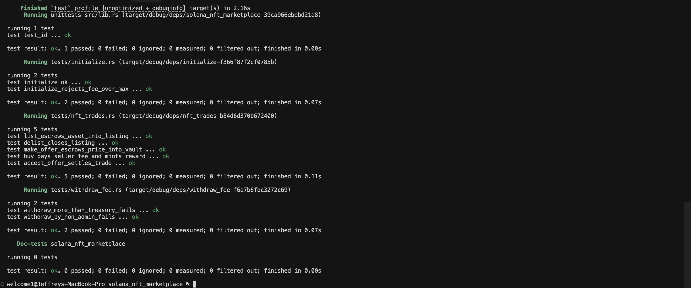

# Solana NFT Marketplace

An on-chain NFT marketplace built with [Anchor](https://www.anchor-lang.com/) and
[Metaplex Core](https://developers.metaplex.com/core). Sellers list Core assets at a
fixed price, buyers purchase directly or make standalone offers, and the marketplace
collects a configurable fee on every sale that the admin can withdraw from a treasury.

Program ID: `An54AJiZa84tpn2obdm5p5s91fibELNvuePVC92dJdX2`

## Features

- **Initialize** — create a marketplace with a name and a basis-point fee, plus its
  treasury and reward PDAs.
- **List / Delist** — escrow a Core asset under a `Listing` PDA at a chosen price, or
  refund it back to the maker.
- **Buy** — pay the seller in SOL, transfer the NFT to the buyer, and route the
  marketplace fee to the treasury.
- **Make Offer / Accept Offer** — a buyer locks SOL in an offer vault; the seller accepts
  to settle the trade and pull the escrowed funds.
- **Withdraw Fee** — the admin withdraws accumulated fees from the treasury (capped at the
  available balance).

## Accounts

| Account | Purpose |
| --- | --- |
| `MarketPlace` | Global config — admin, fee, name, and PDA bumps. |
| `Listing` | An NFT escrowed for sale — maker, asset, and price. |
| `Offer` | A standalone bid — target listing, offer maker, price, and vault bump. |

## Project Layout

```
programs/solana_nft_marketplace/
  src/
    lib.rs            # program entrypoints
    state.rs          # account definitions
    constants.rs      # PDA seeds
    error.rs          # custom errors
    instructions/     # one file per instruction
  tests/              # LiteSVM integration tests
```

## Build & Test

```bash
# Build the program
anchor build

# Run the Rust integration tests (LiteSVM)
cargo test
```

The test suite runs against [LiteSVM](https://github.com/LiteSVM/litesvm) and covers
initialization (including fee validation), the full list → buy / offer → accept trade
flows, and admin fee withdrawal with access-control checks.

## Passing Tests


